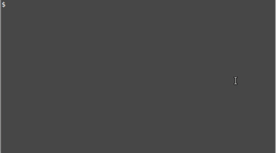

# mastermind

A console implementation of Mastermind board game. See [Wikipedia Mastermind (board game)](https://en.wikipedia.org/wiki/Mastermind_(board_game)) for gameplay and  rules. 

## Build 

Run `make RunGame` to build the program

## Running the tests

Run `make test` to build and run unit tests

## Example run

